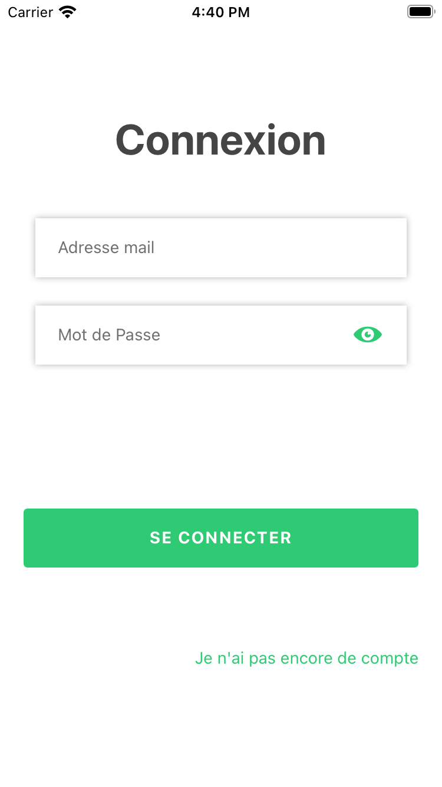
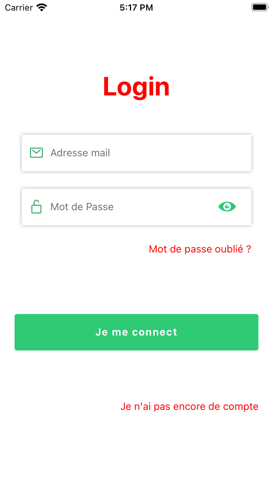
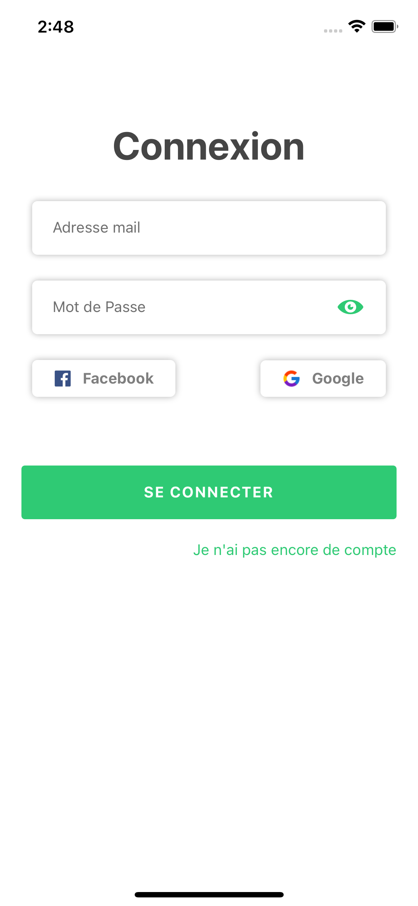
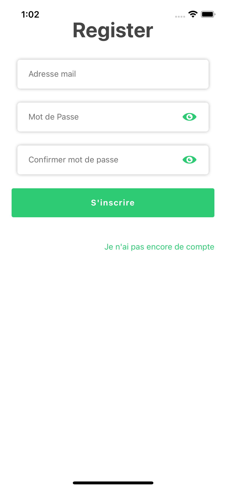
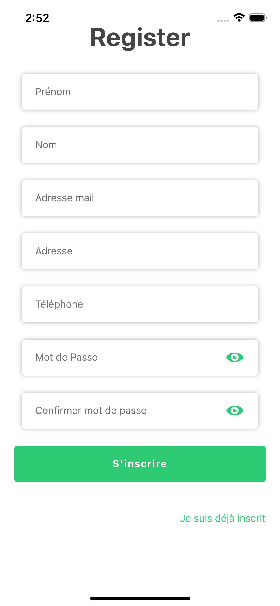
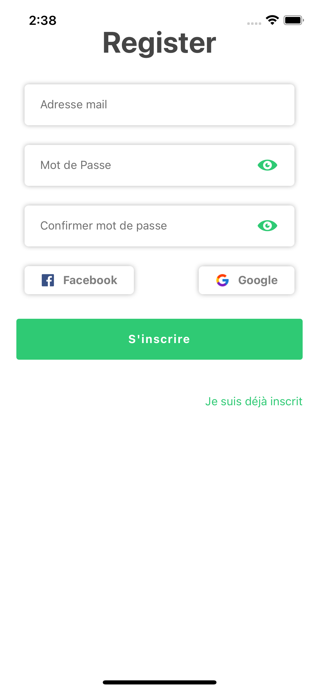
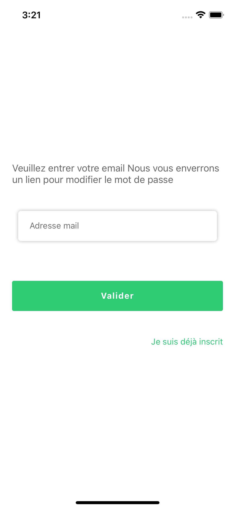
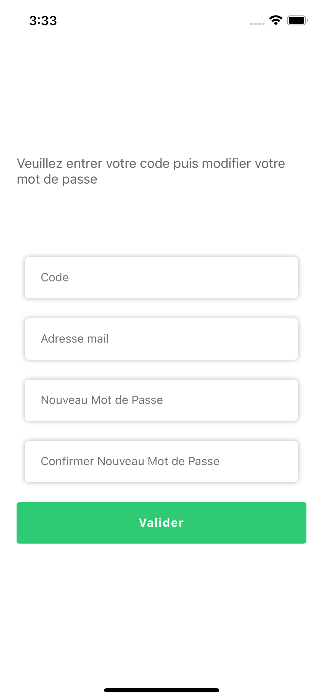

This project is a authentication page with built-in buttons

#### This package is currently only maintained for Expo managed React Native projects, support for bare React Native projects is coming soon

## Installation

Add the dependency:

```
npm i volkeno-login
```

or

```
yarn add volkeno-login
```

# Login

## Peer Dependencies

##### IMPORTANT! You need install them.

```json
 "react": "^16.0.0-beta.5",
 "react-native": "^0.49.1"
```

## Basic Usage

**First step:** import the component:

```javascript
import { Login } from "Auth";
```

**Second step:** Use the login

```jsx
export default function App() {
  const [showPassword, setShowPassword] = React.useState(false);
  const [email, setEmail] = React.useState("");
  const [password, setPassword] = React.useState("");
  const [errors, setErrors] = React.useState({});

  const submit = async () => {
    Alert.alert("Félicitation", "Connexion réussie");
  };

  return (
    <View style={styles.container}>
      <LoginVolkeno
        showPassword={showPassword}
        setShowPassword={setShowPassword}
        email={email}
        setEmail={setEmail}
        password={password}
        setPassword={setPassword}
        errors={errors}
        setErrors={setErrors}
        title={"Login"}
        forgotPasswordText={"Mot de passe oublié ?"}
        OnSubmit={submit}
        textRedirectRegisterStyle={{ color: "red" }}
      />
    </View>
  );
}
```

<p float="center">

</p>

Here we have a function which reacts when the connect button is clicked.
showPassword and setShowPassword allows you to activate or deactivate the visibility of the password.

email and setEmail allows you to enter and modify the email variable when typing it.

password and setPassword are used to enter and modify the password variable when typed.

the variables errors and setErrors are mandatory. They allow you to display errors when validating the email and password

## Configuration - Props

**Props require**

| Property        |   Type   | Default | Description                                                                     |
| --------------- | :------: | :-----: | ------------------------------------------------------------------------------- |
| showPassword    | boolean  |  false  | Activate to see the password                                                    |
| setShowPassword | function |  void   | Called for allows you to activate or deactivate the visibility of the password. |
| email           |  string  |    -    | Enter email address                                                             |
| setEmail        | function |  void   | Called for allows you to enter and modify the email variable when typing it.    |
| password        |  string  |    -    | Enter Password                                                                  |
| setPassword     | function |  void   | Used to enter and modify the password variable when typed.                      |
| errors          |  object  |  void   | Object used to store email and password validation errors                       |
| setErrors       | function |  void   | They allow you to display errors when validating the email and password         |
| OnSubmit        | function |  void   | Function that reacts when the connect button is clicked.                        |

**Other props**
| Property | Type | Default | Description |
| --------------- | :------: | :-----: | -------------------- |
| title | string | "Connexion" | change connection text |
| forgotPasswordText | string | - | Put a forgotten password text |
| pressForgotPassword | function | void | handle forgotPasswordText button is pressed |
| colorIconPassword | color | "#2FCA74" | eye color |
| textConnexion | string | "SE CONNECTER" | change text on login button |
| leftIconPassword | function | void | put a key icon 🔑 for the password |
| leftIconEmail | function | void | put a mail icon 📧 for the email address |
| textRedirectRegister | string | - | Allow to put a text which will make it possible to make a redirection towards the page of registration |
| pressRedirectRegister | function | void | handle textRedirectRegister button is pressed |

**Styles props**
| Property | Type | Default | Description |
| --------------- | :------: | :-----: | -------------------- |
| styles | style | {flex: 1, paddingHorizontal: 20} | modify or replace the default style of the entire page |
| textRedirectRegisterStyle | style | { color: "#2FCA74",textAlign: "center",fontSize: 14 } | change or override the default styling for textRedirectRegister |
| connexionButtonStyle | style | {backgroundColor: "#2FCA74",height: 50,minWidth: "100%",paddingHorizontal: 25} | modify or replace the default style of the connexion button |
| connexionTitleStyle | style | {color: "white",fontWeight: "bold",letterSpacing: 1,ontSize: 14} | change or override the default styling for login text |
| titleStyle | style | {marginVertical: 30,fontWeight: "bold",color: "#454545",fontSize: 36,textAlign: "center", | change or override the default styling for connexion text |
| forgotPasswordTextStyle | style | { color: "#454545" }| hange or override the default styling forgotPasswordText|

```jsx
export default function App() {
  const [showPassword, setShowPassword] = React.useState(false);
  const [email, setEmail] = React.useState("");
  const [password, setPassword] = React.useState("");
  const [errors, setErrors] = React.useState({});

  const submit = async () => {
    Alert.alert("Félicitation", "Connexion réussie");
  };

  return (
    <View style={styles.container}>
      <Login
        OnSubmit={submit}
        pressForgotPassword={() => {
          Alert.alert("change passWord");
        }}
        pressRedirectRegister={() => {
          Alert.alert("redirect regidter");
        }}
        showPassword={showPassword}
        setShowPassword={setShowPassword}
        email={email}
        setEmail={setEmail}
        password={password}
        setPassword={setPassword}
        errors={errors}
        setErrors={setErrors}
        title={"Login"}
        forgotPasswordText={"Mot de passe oublié ?"}
        forgotPasswordTextStyle={{
          color: "red",
          textAlign: "center",
        }}
        titleStyle={{
          color: "red",
          marginVertical: 30,
          fontWeight: "bold",
          fontSize: 36,
          textAlign: "center",
        }}
        textConnexion={"Je me connect"}
        leftIconPassword={
          <Icon name="ios-lock-open-outline" size={20} color={Colors.bgApp2} />
        }
        leftIconEmail={
          <Icon name="mail-outline" size={20} color={Colors.bgApp2} />
        }
        textRedirectRegisterStyle={{ color: "red" }}
        textRedirectRegister="Je n'ai pas encore de compte"
        styles={{}}
      />
    </View>
  );
}
```

<p float="center">

</p>

**Social props**

| Property                     |   Type   | Default | Description                                                           |
| ---------------------------- | :------: | :-----: | --------------------------------------------------------------------- |
| facebook                     | boolean  |  false  | Activate to see the facebook button                                   |
| google                       | boolean  |  false  | Activate to see the google button                                     |
| registerSocialSubmit         | function |  void   | Function that reacts when one of the social media buttons is clicked  |
| facebookAppId                |  string  |    -    | this is the AppId for Facebook. It is obligatory                      |
| iosClientId                  |  string  |    -    | this is the iosClientId for Google. It is obligatory                  |
| androidClientId              |  string  |    -    | this is the androidClientId for Google. It is obligatory              |
| iosStandaloneAppClientId     |  string  |    -    | this is the iosStandaloneAppClientId for Google. It is obligatory     |
| androidStandaloneAppClientId |  string  |    -    | this is the androidStandaloneAppClientId for Google. It is obligatory |

<p float="center">

</p>

# Register

## Peer Dependencies

##### IMPORTANT! You need install them.

```json
 "react": "^16.0.0-beta.5",
 "react-native": "^0.49.1"
```

## Basic Usage

**First step:** import the component:

```javascript
import { Register } from "Auth";
```

**Second step:** Use the register

```jsx
export default function App() {
  const [showPassword, setShowPassword] = React.useState(false);
  const [email, setEmail] = React.useState("");
  const [password, setPassword] = React.useState("");
  const [password_confirmation, setPassword_confirmation] = React.useState("");
  const [errors, setErrors] = React.useState({});

  const submit = async () => {
    Alert.alert("Félicitation", "Connexion réussie");
  };

  return (
    <View style={styles.container}>
      <Register
        OnSubmit={submit}
        setShowPassword={setShowPassword}
        showPassword={showPassword}
        email={email}
        setEmail={setEmail}
        password={password}
        setPassword={setPassword}
        password_confirmation={password_confirmation}
        setPassword_confirmation={setPassword_confirmation}
        errors={errors}
        setErrors={setErrors}
        textRedirectLogin="Je n'ai pas encore de compte"
      />
    </View>
  );
}
```

<p float="center">

</p>

Here we have a function which reacts when the connect button is clicked.
showPassword and setShowPassword allows you to activate or deactivate the visibility of the password.

email and setEmail allows you to enter and modify the email variable when typing it.

password and setPassword are used to enter and modify the password variable when typed.

the variables errors and setErrors are mandatory. They allow you to display errors when validating the email and password

## Configuration - Props

**Props require**

| Property                 |   Type   | Default | Description                                                                     |
| ------------------------ | :------: | :-----: | ------------------------------------------------------------------------------- |
| showPassword             | boolean  |  false  | Activate to see the password                                                    |
| setShowPassword          | function |  void   | Called for allows you to activate or deactivate the visibility of the password. |
| email                    |  string  |    -    | Enter email address                                                             |
| setEmail                 | function |  void   | Called for allows you to enter and modify the email variable when typing it.    |
| password                 |  string  |    -    | Enter password                                                                  |
| setPassword              | function |  void   | Used to enter and modify the password variable when typed.                      |
| password_confirmation    |  string  |    -    | Enter Password Confirmation                                                     |
| setPassword_confirmation | function |  void   | Used to enter and modify the Password Confirmation variable when typed.         |
| errors                   |  object  |  void   | Object used to store email and password validation errors                       |
| setErrors                | function |  void   | They allow you to display errors when validating the email and password         |
| OnSubmit                 | function |  void   | Function that reacts when the registration button is clicked.                   |

**Other props**

| Property                   |   Type   |         Default          | Description                                                                                          |
| -------------------------- | :------: | :----------------------: | ---------------------------------------------------------------------------------------------------- |
| title                      |  string  |       "Connexion"        | change connection text                                                                               |
| colorIconPassword          |  color   |        "#2FCA74"         | eye color                                                                                            |
| textButtonRegister         |  string  |       "S'inscrire"       | change text on register button                                                                       |
| leftIconPassword           | function |           void           | put a key icon 🔑 for the password                                                                   |
| leftIconEmail              | function |           void           | put a mail icon 📧 for the email address                                                             |
| leftIconFirstName          | function |           void           | put an icon at firstName                                                                             |
| leftIconLastName           | function |           void           | put an icon at lastName                                                                              |
| leftIconAdresse            | function |           void           | put an icon at adresse                                                                               |
| leftIconPhone              | function |           void           | put a phone icon 📞 for phone                                                                        |
| textRedirectLogin          |  string  |  "Je suis déjà inscrit"  | Allow to put a text which will make it possible to make a redirection towards the page of connection |
| pressRedirectLogin         | function |           void           | handle textRedirectLogin button is pressed                                                           |
| first_name                 |  string  |          false           | enter first_name if it exists                                                                        |
| last_name                  |  string  |          false           | enter last_name if it exists                                                                         |
| phone                      |  string  |          false           | enter phone if it exists                                                                             |
| adresse                    |  string  |          false           | enter adresse if it exists                                                                           |
| setFirstName               | function |           void           | Called for allows you to enter and modify the first_name variable when typing it                     |
| setLastName                | function |           void           | Called for allows you to enter and modify the last_name variable when typing it                      |
| setPhone                   | function |           void           | Called for allows you to enter and modify the phone variable when typing it                          |
| setAdresse                 | function |           void           | Called for allows you to enter and modify the adresse variable when typing it                        |
| labelEmail                 |  string  |      "Adresse mail"      | Change the Email label                                                                               |
| labelPassword              |  string  |      "Mot de Passe"      | Change the password label                                                                            |
| labelPassword_confirmation |  string  | "Confirmer mot de passe" | Change the Password Confirmation label                                                               |
| labelFirstName             |  string  |         "Prénom"         | Change the first_name label if first_name exists                                                     |
| labelLastName              |  string  |          "Nom"           | Change the last_name label if last_name exists                                                       |
| labelPhone                 |  string  |       "Téléphone"        | Change the phone label if phone exists                                                               |
| labelAdresse               |  string  |        "Adresse"         | Change the adresse label if adresse exists                                                           |

**Styles props**

| Property               | Type  |                                          Default                                          | Description                                                  |
| ---------------------- | :---: | :---------------------------------------------------------------------------------------: | ------------------------------------------------------------ |
| styles                 | style |                             {flex: 1, paddingHorizontal: 20}                              | modify or replace the default style of the entire page       |
| textRedirectLoginStyle | style |                   { color: "#2FCA74",textAlign: "center",fontSize: 14 }                   | change or override the default styling for textRedirectLogin |
| connexionButtonStyle   | style |      {backgroundColor: "#2FCA74",height: 50,minWidth: "100%",paddingHorizontal: 25}       | modify or replace the default style of the connexion button  |
| connexionTitleStyle    | style |             {color: "white",fontWeight: "bold",letterSpacing: 1,ontSize: 14}              | change or override the default styling for login text        |
| titleStyle             | style | {marginVertical: 30,fontWeight: "bold",color: "#454545",fontSize: 36,textAlign: "center", | change or override the default styling for connexion text    |

<p float="center">

</p>

**Social props**

| Property                     |   Type   | Default | Description                                                           |
| ---------------------------- | :------: | :-----: | --------------------------------------------------------------------- |
| facebook                     | boolean  |  false  | Activate to see the facebook button                                   |
| google                       | boolean  |  false  | Activate to see the google button                                     |
| registerSocialSubmit         | function |  void   | Function that reacts when one of the social media buttons is clicked  |
| facebookAppId                |  string  |    -    | this is the AppId for Facebook. It is obligatory                      |
| iosClientId                  |  string  |    -    | this is the iosClientId for Google. It is obligatory                  |
| androidClientId              |  string  |    -    | this is the androidClientId for Google. It is obligatory              |
| iosStandaloneAppClientId     |  string  |    -    | this is the iosStandaloneAppClientId for Google. It is obligatory     |
| androidStandaloneAppClientId |  string  |    -    | this is the androidStandaloneAppClientId for Google. It is obligatory |

<p float="center">

</p>

# Forgot Password

## Peer Dependencies

##### IMPORTANT! You need install them.

```json
 "react": "^16.0.0-beta.5",
 "react-native": "^0.49.1"
```

## Basic Usage

**First step:** import the component:

```javascript
import { RequestPasswordReset } from "Auth";
```

**Second step:** Use the RequestPasswordReset

```jsx
export default function App() {
  const [email, setEmail] = React.useState("");
  const [errors, setErrors] = React.useState({});

  const submit = async () => {
    Alert.alert("Félicitation", "Connexion réussie");
  };

  return (
    <View style={styles.container}>
      <RequestPasswordReset
        OnSubmit={submit}
        email={email}
        setEmail={setEmail}
        errors={errors}
        setErrors={setErrors}
      />
    </View>
  );
}
```

**Props require**

| Property  |   Type   | Default | Description                                                                  |
| --------- | :------: | :-----: | ---------------------------------------------------------------------------- |
| email     |  string  |    -    | Enter email address                                                          |
| setEmail  | function |  void   | Called for allows you to enter and modify the email variable when typing it. |
| errors    |  object  |  void   | Object used to store email and password validation errors                    |
| setErrors | function |  void   | They allow you to display errors when validating the email and password      |
| OnSubmit  | function |  void   | Function that reacts when the registration button is clicked.                |

**Other props**

| Property           |   Type   |                                         Default                                         | Description                                                                                          |
| ------------------ | :------: | :-------------------------------------------------------------------------------------: | ---------------------------------------------------------------------------------------------------- |
| title              |  string  | "Veuillez entrer votre email Nous vous enverrons un lien pour modifier le mot de passe" | change connection text                                                                               |
| leftIconEmail      | function |                                          void                                           | put a mail icon 📧 for the email address                                                             |
| textRedirectLogin  |  string  |                                 "Je suis déjà inscrit"                                  | Allow to put a text which will make it possible to make a redirection towards the page of connection |
| pressRedirectLogin | function |                                          void                                           | handle textRedirectLogin button is pressed                                                           |
| labelEmail         |  string  |                                     "Adresse mail"                                      | Change the Email label                                                                               |
| textValidate       |  string  |                                        "Valider"                                        | change text on validate button                                                                       |

**Styles props**

| Property               | Type  |                                          Default                                          | Description                                                  |
| ---------------------- | :---: | :---------------------------------------------------------------------------------------: | ------------------------------------------------------------ |
| styles                 | style |                             {flex: 1, paddingHorizontal: 20}                              | modify or replace the default style of the entire page       |
| textRedirectLoginStyle | style |                   { color: "#2FCA74",textAlign: "center",fontSize: 14 }                   | change or override the default styling for textRedirectLogin |
| connexionButtonStyle   | style |      {backgroundColor: "#2FCA74",height: 50,minWidth: "100%",paddingHorizontal: 25}       | modify or replace the default style of the connexion button  |
| connexionTitleStyle    | style |             {color: "white",fontWeight: "bold",letterSpacing: 1,ontSize: 14}              | change or override the default styling for login text        |
| titleStyle             | style | {marginVertical: 30,fontWeight: "bold",color: "#454545",fontSize: 36,textAlign: "center", | change or override the default styling for connexion text    |

<p float="center">

</p>

### after that you can use ResetPassword

# ResetPassword

## Peer Dependencies

##### IMPORTANT! You need install them.

```json
 "react": "^16.0.0-beta.5",
 "react-native": "^0.49.1"
```

## Basic Usage

**First step:** import the component:

```javascript
import { Login } from "Auth";
```

**Second step:** Use the login

```jsx
export default function App() {
  const [email, setEmail] = React.useState("");
  const [code, setCode] = React.useState("");
  const [password, setPassword] = React.useState("");
  const [confrimPassword, setConfrimPassword] = React.useState("");
  const [errors, setErrors] = React.useState({});

  const submit = async () => {
    Alert.alert("Félicitation", "Connexion réussie");
  };

  return (
    <View style={styles.container}>
      <ResetPassword
        OnSubmit={submit}
        email={email}
        setEmail={setEmail}
        code={code}
        setCode={setCode}
        password={password}
        setPassword={setPassword}
        confrimPassword={confrimPassword}
        setConfrimPassword={setConfrimPassword}
        errors={errors}
        setErrors={setErrors}
      />
    </View>
  );
}
```

<p float="center">

</p>

**Props require**

| Property           |   Type   | Default | Description                                                                     |
| ------------------ | :------: | :-----: | ------------------------------------------------------------------------------- |
| showPassword       | boolean  |  false  | Activate to see the password                                                    |
| setShowPassword    | function |  void   | Called for allows you to activate or deactivate the visibility of the password. |
| email              |  string  |    -    | Enter email address                                                             |
| setEmail           | function |  void   | Called for allows you to enter and modify the email variable when typing it.    |
| code               |  string  |    -    | Enter the code you received                                                     |
| setCode            | function |  void   | Called for allows you to enter and modify the code variable when typing it.     |
| password           |  string  |    -    | Enter Password                                                                  |
| setPassword        | function |  void   | Used to enter and modify the password variable when typed.                      |
| confrimPassword    |  string  |    -    | Enter Password Confirmation                                                     |
| setPassword        | function |  void   | Used to enter and modify the password variable when typed.                      |
| setConfrimPassword | function |  void   | Used to enter and modify the password Confirmation variable when typed.         |
| errors             |  object  |  void   | Object used to store email and password validation errors                       |
| setErrors          | function |  void   | They allow you to display errors when validating the email and password         |
| OnSubmit           | function |  void   | Function that reacts when the connect button is clicked.                        |

**Other props**
| Property | Type | Default | Description |
| --------------- | :------: | :-----: | -------------------- |
| title | string | "Veuillez entrer votre code puis modifier votre mot de passe" | change connection text |
| colorIconPassword | color | "#2FCA74" | eye color |
| textValidate | string | "Valider" | change text on validate button |
| leftIconPassword | function | void | put a key icon 🔑 for the password |
| leftIconEmail | function | void | put a mail icon 📧 for the email address |
| leftIconCode | function | void | put a icon for the code |
| labelCode | string | "Code" | Change the Code label |
| labelEmail | string | "Adresse mail" | Change the Email label |
| labelPassword | string | "Nouveau Mot de Passe" | Change the password label |
| labelConfrimPassword | string | "Confirmer Nouveau Mot de Passe" | Change the Password Confirmation label |

**Styles props**
| Property | Type | Default | Description |
| --------------- | :------: | :-----: | -------------------- |
| styles | style | {flex: 1, paddingHorizontal: 20} | modify or replace the default style of the entire page |
| connexionButtonStyle | style | {backgroundColor: "#2FCA74",height: 50,minWidth: "100%",paddingHorizontal: 25} | modify or replace the default style of the connexion button |
| connexionTitleStyle | style | {color: "white",fontWeight: "bold",letterSpacing: 1,ontSize: 14} | change or override the default styling for login text |
| titleStyle | style | {marginVertical: 30,fontWeight: "bold",color: "#454545",fontSize: 36,textAlign: "center", | change or override the default styling for connexion text |
